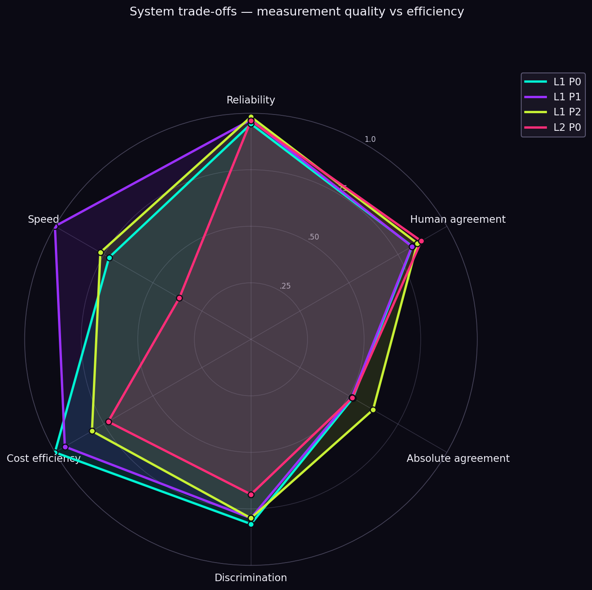
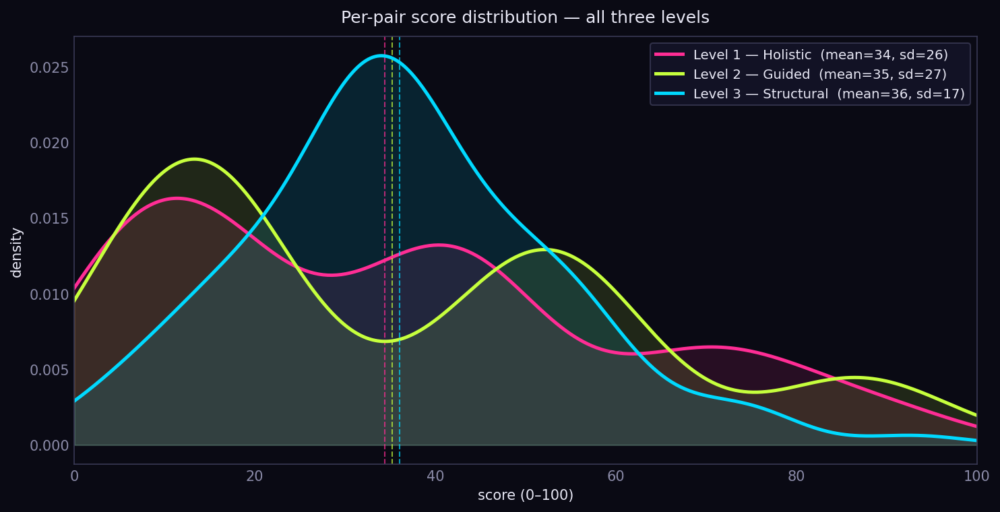

# Evaluating an LLM-Based CV–Job Fit Scoring System

## About

AI Evaluation & Quality Scientist with a psychometrics background.

I focus on how AI systems **make decisions about people** — evaluating whether their outputs are reliable, valid, and decision-relevant.

This project evaluates an LLM-based CV–job fit scoring system as a **measurement instrument**, not just a tool, under three progressively more structured designs.

---

## Quick Results Snapshot

| Property (best observed) | Level 1 — Holistic | Level 2 — Guided |
|---|---|---|
| Reliability (ICC-A) | 0.95 – 0.98 (0–3 scale)<br>0.99 (0–100 scale) | 0.97 |
| Human agreement (Spearman ρ) | 0.82 – 0.85 | **0.87** |
| Agreement strength (Weighted κ) | 0.51 – 0.62 | 0.52 |
| Discriminant validity (Kendall W) | 0.56 – 0.79 across pools | 0.41 – 0.79 across pools |
| Systematic bias (LLM − human) | +0.41 to +0.47 (d ≈ 0.65) | +0.59 (d = 0.97) |
| Best overall prompt | Holistic rubric + 0–100 scale (L1 P2) | — |

The system is **consistently reliable** (ICC ≥ 0.95) and shows **moderate-to-strong rank correlation with human judgment** (Spearman ρ ≈ 0.82–0.87, n = 32, single rater). Adding structured sub-scores in Level 2 improves **auditability** but does **not** materially change agreement with human ratings. All four systems over-rate human labels by ~0.4–0.6 of a scale point; this positive bias is largest at Level 2.



*Each axis is normalised 0→1, higher = better. Reliability = ICC(A,1) on the 0–3 scale; Human agreement = Spearman ρ vs the n = 32 human labels; Absolute agreement = Weighted Cohen κ on the same labels; Discrimination = Kendall's W on the filtered main pool (n = 16); Cost efficiency and Speed are inverse-normalised tokens and latency. L1 P2 wins on reliability and absolute agreement; L2 P0 wins on rank correlation; L1 P0 wins on cost; L2 P0 is the slowest.*

---

## Core Finding

LLM-based scoring is **highly reliable and moderately valid** across both holistic and structured-categorical designs.

Adding categorical structure does not improve agreement with human judgment on this dataset — but makes every scoring decision fully auditable and re-tunable without re-prompting.

---

## Research Design

The same system is evaluated under three levels of structural constraint:

```
CV + Job Description
        ↓
  ├── Level 1 — Holistic
  │     LLM → single score (0–3 and 0–100)
  │
  ├── Level 2 — Guided
  │     LLM → categorical labels per dimension (skills, role, domain, education)
  │     → fixed-weight code aggregation → fit_score_100
  │
  └── Level 3 — Structured
        system → section extraction + embeddings + similarity
        → same fixed-weight aggregation

→ Compare measurement properties across levels
```

---

## Why This Matters

If an AI system is used to evaluate people:

* decision thresholds can fail when scores cluster
* high consistency can mask systematic bias
* single scores are difficult to audit or explain

Under the EU AI Act, hiring tools are classified as high-risk and must support human oversight, auditability, and documentation of limitations. Understanding the measurement properties of LLM-based scorers is therefore not optional.

---

## Level 1: Holistic Evaluation

Three prompt variants (P0 minimal / P1 rubric / P2 rubric + 0–100 scale) on **75 JDs × 3 CV profiles × 3 runs** (reliability and flip-test scope). **Criterion validity** is computed on the 32 psychometric JDs with single-rater human labels.

### Key findings

* **Excellent reliability.** ICC(A,1) = 0.95–0.98 (0–3 scale) and 0.99 (0–100 scale at P2); Fleiss κ ≥ 0.91 on verdict consistency.
* **Moderate-to-strong criterion validity.** Spearman ρ = 0.82–0.85 vs human labels (n = 32, single rater); Weighted Cohen κ = 0.51–0.62.
* **Discriminant 3-way flip test passes.** Assessment Scientist CV leads on Psychometric JDs (Kendall W = 0.79, filtered n = 16); HR CV leads on HR JDs (W = 0.67); Engineering CV leads on Engineering JDs (W = 0.56). All large by Cohen's convention.
* **Mild positive bias.** The LLM rates +0.41 to +0.47 of a scale point higher than the human rater on average (Cohen's d ≈ 0.65, medium).
* **Rubric prompt does not improve agreement.** Adding explicit skills / experience / education weights to the prompt leaves Spearman ρ within noise of the minimal prompt (0.823 vs 0.821).

---

## Level 2: Guided Evaluation

LLM outputs categorical labels per dimension (YES/PARTIAL/NO for skills, SAME/SIMILAR/DIFFERENT for role, etc.). Code applies fixed scoring maps and computes `fit_score_100` using a transparent weighted formula. A holistic label is collected independently for comparison.

Scoring run on **75 JDs × 3 CVs × 3 runs** (one HR JD dropped to a Gemini-side 500 error). Human-label comparison: same 32 psychometric JDs as Level 1.

### Key findings

* **Reliability matches Level 1.** ICC(A,1) = 0.967 pooled; Fleiss κ = 0.87–0.96 on the four categorical dimension labels.
* **Validity within noise of Level 1.** Spearman ρ = 0.87 (highest in the project), Weighted κ = 0.52; CIs overlap with L1. No between-system significance test performed.
* **3-way flip test passes all three JD pools.** Kendall W = 0.41–0.79 across pool × score-output combinations; large in eight of nine combinations, medium in one (`score_0-100` on Engineering JDs, W = 0.41).
* **Larger positive bias than Level 1.** +0.59 (Cohen's d = 0.97, large) — the structured design adds transparency but does not reduce over-rating.
* **Advantage: full auditability.** Intermediate dimension labels and formula weights are both inspectable; the formula can be re-tuned without re-querying the LLM.

Human-label comparison expanded to additional CV profiles is planned.

---

## Level 3: Structured Evaluation

> 🚧 **Editing in progress** — this section is a short procedural summary; numbers and validation will be expanded.

Job fit is computed through explicit text structuring + embedding similarity — the LLM only *structures* the text, the judgment itself is deterministic. Run on **75 JDs × 3 CVs = 225 (CV, JD) pairs**.

### Pipeline (procedural)

1. **Segment + tag** — an LLM splits each JD and CV into lines and tags every line `skills / experience / education / mixed / other` (labels by `line_id`, no text echoed). `other` is dropped.
2. **Normalise** — a second LLM pass turns each segment into canonical **skill / experience** labels; education is reduced to one degree level (CV: highest held, JD: minimum required).
3. **Embed** — all skill labels of a document → one vector; all experience labels → one vector (`all-MiniLM-L6-v2`, L2-normalised). Education is not embedded.
4. **Per-pair similarity** — cosine of the skills vectors and of the experience vectors for each (CV, JD) pair.
5. **Education match** — discrete: no requirement → pass; else the CV degree must reach the JD's required level.
6. **Transform to 0–100** — fixed anchor-linear rescale `clip((cos − 0.30)/(0.80 − 0.30), 0, 1) × 100` (0.30 / 0.80 = off-domain floor / CV-mirroring ceiling anchors), then the Level-2 weights `0.6 · skills + 0.3 · experience + 0.1 · education`; with no degree requirement, education's weight is redistributed onto skills + experience.

### Score distribution — all three levels

The same 225 pairs scored three ways, all on 0–100 (each level aggregated to one score per pair):



The three means almost coincide (**L1 ≈ 34, L2 ≈ 35, L3 ≈ 36**), but the *shape* differs: the LLM-judge levels (L1, L2) are wide and near-bimodal (sd ≈ 26), while the embedding-based Level 3 is markedly tighter (sd ≈ 17) — more structure, less spread.

### Status

Pipeline runs end-to-end; validation (construct validity, coarse-vs-fine tag agreement, discriminant check) done. Evaluation against human gold labels and a final weighting decision are pending. **Known limitation:** degree extraction is US-centric and misses non-US credentials — reported with that caveat.

---

## Scope

**System under evaluation:** Career Pilot
Input: CV + Job Description
Output: Score (0–100) + verdict (Apply / Consider / Skip)

The system is intentionally transparent: rubric, prompt, thresholds, and temperature are all configurable.

---

## Methodology

**Dataset.** 75 unique job descriptions across three domain pools (Psychometric / HR / Engineering); 3 CV profiles (Assessment Scientist / Head of People / Solution Architect); 3 LLM runs per pair. Reliability and discriminant validity use the full 75-JD pool; criterion validity uses the 32 psychometric JDs with human labels.

**Human labels.** 32 (JD × Assessment scientist CV) pairs, single rater, 4-level ordinal scale (0–3). The rater is also the owner of the Assessment Scientist CV; the protocol mitigates this with first-time exposure during labeling, company-name removal, and a written rubric — but criterion validity should be read as alignment with one informed person's judgment, not with a population of expert raters.

**Model.** Gemini 3.1 Flash Lite preview, temperature = 1.0.

**Filtered subset for discriminant validity.** On the Psychometric pool, only the 16 JDs where `cv_primary` received a human label ≥ 2 (Consider / Apply) are used, to remove deliberately irrelevant items that compress effect sizes through floor overlap.

---

## Detailed Reports

* **Overview — design, findings, discussion**
  [overview.md](overview.md)

* **Level 1 — Holistic**
  [level_1_holistic_evaluation.md](level_1_holistic_evaluation.md)

* **Level 2 — Guided**
  [level_2_guided_evaluation.md](level_2_guided_evaluation.md)

* **Level 3 — Structured**
  Design and dataset documentation in progress 
  [level_3_structural_evaluation.md](level_3_structural_evaluation.md)

---

## What I Do

I evaluate AI systems that operate on human data.

* audit AI scoring and ranking systems
* design evaluation frameworks (validity, reliability, calibration)
* identify structural failure modes

---

## Get Involved

* SME review (psychometrics / HR)
* contribute annotation data
* apply methodology to your system

Try the system: https://cv-matcher-azure.vercel.app

Contact: [olgamaslenkova@gmail.com](mailto:olgamaslenkova@gmail.com)

---

System under evaluation:
https://github.com/Holly-olly/career-pilot

---

## Repository Structure

```
llm_evaluation/
├── README.md                              # this file — landing page
├── overview.md                            # research design + summary findings
├── level_1_holistic_evaluation.md         # Level 1 detailed report
├── level_2_guided_evaluation.md           # Level 2 detailed report
├── level_3_structural_evaluation.md       # Level 3 plan (in progress)
│
├── scripts/                               # analysis pipeline (incl. scripts/figures/)
├── notebooks/                             # analysis notebook
└── results/                               # master CSVs + analysis/ + figures/
```
