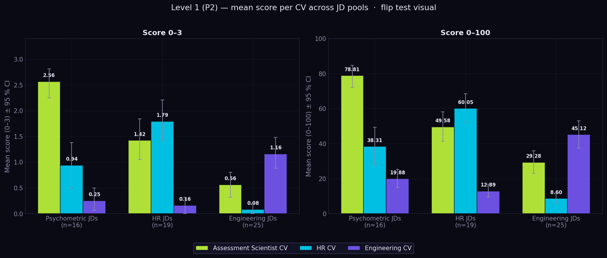

# Overview

## 1. Why This Project Exists

AI systems are increasingly used to evaluate people in employment contexts: screening CVs, ranking candidates, recommending applications, and supporting hiring decisions. However, many LLM-powered hiring tools are evaluated primarily through surface-level engineering metrics while lacking the measurement rigor traditionally required in human evaluation systems.

This project was created to study LLM-based hiring systems not only as generative AI tools, but as measurement systems operating on human data.

The project combines:

* AI/engineering evaluation approaches
* psychometric measurement principles
* responsible AI and regulatory perspectives

The central question is:

```text id="core_question"
How does increasing structural transparency change the behavior, interpretability, and evaluation quality of LLM-based hiring systems?
```

---

# 2. Why Transparency Matters

Transparency in AI hiring systems is no longer only an ethical question; it is increasingly becoming a legal and operational requirement.

Under the European Union Artificial Intelligence Act, AI systems used for recruitment and candidate screening are classified as high-risk systems. Similar regulatory directions are visible in New York City Local Law 144 and other emerging AI governance frameworks.

These systems are expected to support:

* human oversight
* auditability
* explainability
* documentation of limitations and risks

A single opaque LLM-generated score is difficult to audit or interpret. This project therefore studies whether progressively more structured matching approaches improve transparency and measurement quality.

---

# 3. Three Levels of Evaluation

The project compares three progressively more structured approaches to CV–job description (JD) matching.

| Level                | Method                                                                          | Output Structure                                                    | Purpose                              |
| -------------------- | ------------------------------------------------------------------------------- | ------------------------------------------------------------------- | ------------------------------------ |
| Level 1 — Holistic   | Single-prompt LLM scoring                                                       | One overall score                                                   | Baseline black-box evaluation        |
| Level 2 — Guided     | LLM outputs categorical labels per dimension; code applies fixed scoring maps   | Categorical labels (skills / role / domain / edu) → fit_score_100  | Intermediate auditable approach      |
| Level 3 — Structured | Explicit section extraction + embedding similarity                              | Fully decomposed scoring pipeline                                   | Transparent and auditable evaluation |

---

## Level 1 — Holistic

The LLM receives the full CV and JD and produces:

* a single fit score
* a hiring recommendation
* textual explanation

This level reflects many real-world “prompt + frontend” hiring tools where the scoring logic remains largely opaque.

---

## Level 2 — Guided

The LLM is constrained to output categorical labels per dimension:

* skills
* experience
* education

Code applies fixed scoring maps and computes the final fit score using a transparent weighted formula. This separation isolates judgment (LLM) from aggregation (code), enabling re-weighting without re-prompting

This level introduces partial interpretability while still relying on holistic LLM reasoning.

---

## Level 3 — Structured

The system explicitly segments CVs and JDs into structured components before matching.

The pipeline includes:

* section extraction
* normalization
* embeddings
* section-level similarity comparison
* weighted score aggregation

This level is designed to maximize:

* transparency
* auditability
* decomposability
* measurement control


```text
                               STUDY DESIGN
═══════════════════════════════════════════════════════════════════════════════

                           SHARED DATASET
                    (3 CVs × ~201 Job Descriptions)

                                      │
          ┌───────────────────────────┼───────────────────────────┐
          │                           │                           │
          ▼                           ▼                           ▼

┌──────────────────┐      ┌──────────────────┐      ┌──────────────────┐
│ LEVEL 1          │      │ LEVEL 2          │      │ LEVEL 3          │
│ HOLISTIC         │      │ GUIDED           │      │ STRUCTURED       │
│ Black-box LLM    │      │ Semi-structured  │      │ Fully decomposed │
└──────────────────┘      └──────────────────┘      └──────────────────┘

          │                           │                           │

          │                           │                           │
          ▼                           ▼                           ▼

  SAME MODEL / SAME INPUT      Structured labels          Section extraction
  Gemini 3.1 Flash Lite        from LLM                  + embeddings
  temp = 1.0                   + fixed aggregation

          │                           │                           │

 ┌────────┼────────┐                  │                           │
 │        │        │                  │                           │
 ▼        ▼        ▼                  ▼                           ▼

┌──────┐ ┌──────┐ ┌──────┐   ┌──────────────────┐      ┌──────────────────┐
│ P0   │ │ P1   │ │ P2   │   │ L2 P0            │      │ L3 Structured    │
└──────┘ └──────┘ └──────┘   └──────────────────┘      └──────────────────┘

Minimal   Rubric      Rubric +        Categorical            Explicit section
prompt    weighting   0–100 scale     labels + formula       matching pipeline

score      score       score           skills                 skills similarity
0–3        0–3         0–3             experience             experience similarity
verdict    verdict     0–100           education              education similarity
                         verdict        ↓                     ↓
                                       weighted aggregation         weighted aggregation

```

---

# 4. Shared Dataset Design

The same underlying dataset is reused across evaluation levels whenever possible to enable direct comparison between matching approaches.

---

## CV Inputs

The project uses three real CV profiles, each representing a distinct professional role:

* an Assessment Scientist (psychometrics)
* a Head of People (HR)
* a Solution Architect (engineering)

For each profile, paraphrased and controlled variants are used in robustness and sensitivity sub-studies across the three evaluation methods.

The three profiles are designed to create partial overlap (psychometrician ↔ HR through people processes; psychometrician ↔ engineer through Python/automation) and discriminant separation (HR ↔ engineer minimal overlap).

The dataset is intentionally designed to create:

* partial overlap between domains
* controlled profile differences
* discriminant validity conditions

For example:

* psychometrician ↔ HR overlap through assessment and people processes
* psychometrician ↔ engineer overlap through Python and automation
* HR ↔ engineer minimal overlap

---

## Job Description Inputs

Approximately 200 job descriptions were collected from public sources (manually curated and via Jobicy / The Muse APIs). The set includes general roles, plus HR- and engineering-oriented roles added to support cross-domain comparison.

This 200-JD pool is held as a reserve to support future tests (additional rater coverage, new CV profiles, stability checks). Current evaluation uses a subset of it:

* **Levels 1 and 2** — the same **75 unique JDs**, scored across three CV profiles (cv_primary, cv_hr, cv_engineer).
* **Human labels** — 32 of the 75 JDs were manually labeled (single rater, scale 0–3) on the cv_primary axis, used as the criterion for validity checks at both levels.
* **Level 3** — JD subset to be drawn from the same pool, selected for annotator coverage and domain balance.

JDs were selected and labeled before any AI scoring, to avoid contamination.

---

# 5. Human Annotation Strategy

Human labels are used differently across evaluation levels.

Level 1 uses single-rater holistic labels (32 JDs, one annotator) — sufficient for system characterization, not for method comparison.

Levels 2 and 3 use a structured rubric (skills / role / domain / education / holistic) annotated by 2–3 raters on a shared subset. Each rater annotates only JD–CV pairs in which their own CV is not included, to avoid self-judgment bias.

Detailed annotation protocol, inter-rater agreement targets, and rater assignment are documented in the Level 3 documentation (link to document).

---

# 6. Shared Aggregation Formula

Job fit is operationalized across all three levels with the same fixed formula:

`fit_score = 0.6 · skills + 0.3 · experience + 0.1 · education`

What changes between levels is **how the component inputs are produced**, not how they are combined:

* **Level 1** — formula is described in the prompt; the LLM returns a single holistic score with no component breakdown.
* **Level 2** — the LLM returns categorical labels per component; code applies the formula.
* **Level 3** — embedding-based section similarity produces component scores; same formula applies.

Holding the aggregation constant isolates the source of judgment as the only varying factor across levels.

The weights (0.6 / 0.3 / 0.1) reflect a common operationalization of candidate fit used in industry practice and several published studies (sources to be added). They are a transparent convention — not a derived ground-truth model of hiring decisions.


# 7. What Is Compared Across Levels

The project compares how different evaluation architectures affect:

* ranking quality
* reliability and stability
* calibration
* interpretability
* discriminant validity
* robustness to wording changes
* sensitivity to profile variation
* transparency and auditability

The goal is not to identify a universally optimal hiring model, but to study how structural design changes the observable behavior of AI evaluation systems.

---

# 8. Summary of Findings

Below are the main findings from Levels 1 and 2. Detailed tables, methodology and interpretation are in `level_1_holistic_evaluation.md` and `level_2_guided_evaluation.md`.

**Reliability is excellent and not a differentiator.** Single-call reliability ICC(A,1) on the 0–3 scale ranges from 0.95 (L1 P0) to 0.98 (L1 P2) across all four systems; on the 0–100 scale at L1 P2 the estimate is 0.99. The system reproduces its own scores nearly perfectly across runs; this is a prerequisite, not a result that distinguishes designs.

**Criterion validity is moderate-to-strong but bounded by the single-rater design.** Rank correlation with the human labels (Spearman ρ) sits between 0.82 and 0.87 across systems; the highest rank correlation comes from L2 P0 (ρ = 0.87). Absolute agreement (Weighted Cohen κ) reaches its highest value at L1 P2 (κ = 0.62, substantial); L2 P0 is moderate (κ = 0.52). All four systems show a systematic positive bias against human labels (LLM rates higher), which is largest at L2 P0 (Cohen's d = 0.97, large).

**Summary table — validity vs human labels** (n = 32, Assessment Scientist CV × Psychometric JDs, holistic 0–3):

| System | Spearman ρ | Weighted κ | MAE | Bias (LLM−human) | Exact match |
| ------ | ---------- | ---------- | --- | ---------------- | ----------- |
| L1 P0  | 0.823      | 0.520      | 0.56 | +0.44 (d = 0.65) | 46.9 %      |
| L1 P1  | 0.821      | 0.514      | 0.59 | +0.47 (d = 0.70) | 43.8 %      |
| L1 P2  | 0.849      | **0.623**  | **0.47** | +0.41 (d = 0.66) | **56.2 %** |
| L2 P0  | **0.869**  | 0.517      | 0.59 | +0.59 (d = 0.97) | 46.9 %      |

**Discriminant validity holds — the 3-way flip test passes in every pool** (Friedman omnibus, p < 0.001 in all conditions). Assessment Scientist CV leads on Psychometric JDs, HR CV leads on HR JDs, Engineering CV leads on Engineering JDs. Kendall's W ranges from 0.41 to 0.79 across pool × score-output combinations — large by Cohen's convention (W ≥ 0.5) in eight of nine combinations, medium in one (L2 `score_0-100` on Engineering JDs, W = 0.41). The L2 `score_0-3` discriminates uniformly large across all three pools (W = 0.69–0.73). The formula-aggregated `score_0-100` is more variable (W = 0.41–0.79); the drop on Engineering JDs (0.70 → 0.41) suggests the fixed weights may be sub-optimal, pending a formal weight-sensitivity analysis.

**Summary table — Kendall's W per pool and system:**

| Pool                       | L1 P2 | L2 `score_0-3` | L2 `score_0-100` |
| -------------------------- | ----- | -------------- | ---------------- |
| Psychometric JDs (n = 16)  | 0.79  | 0.69           | 0.63             |
| HR JDs (n = 18 / 19)       | 0.67  | 0.73           | **0.79**         |
| Engineering JDs (n = 25)   | 0.56  | **0.70**       | 0.41             |



*The expected leader CV scores highest in every pool: Assessment Scientist CV on Psychometric JDs, HR CV on HR JDs, Engineering CV on Engineering JDs. Ordering reverses with the JD domain — this is the within-design evidence that the score responds to CV–JD fit rather than to a fixed CV identity. L2 produces the same pattern; see `results/figures/L2_mean_per_cv.png`.*

**L1 and L2 produce highly aligned scores at the JD × CV level.** Cross-design ICC(A,1) between L1 P2 and L2 P0 on the 0–100 scale is 0.91; Pearson r = 0.91; no significant mean shift between methods (paired t, p = 0.21). On this dataset, structuring the LLM output and applying a fixed code formula does not change which JD × CV pairs get high or low scores; it changes which intermediate fields are inspectable.

**Efficiency favours L1.** L2 P0 uses ~3 % more tokens than L1 P2 (2,674 vs 2,593 per call) but is ~2.3× slower (17.6 s vs 7.8 s) because of the structured-output overhead. L1 P0 is the cheapest and fastest configuration overall (~2,100 tokens, ~8 s).

**Interpretation.** Across reliability, criterion validity, discriminant validity, and method-to-method agreement, L1 P2 and L2 P0 produce comparable measurement quality. The differences in the validity tables are small relative to bootstrap CIs and were not formally tested between designs. The principal distinction is operational: L2 returns intermediate categorical labels and uses a fixed weighted formula, which allows re-tuning the aggregation without re-querying the LLM and supports auditability requirements expected under high-risk AI regulation (EU AI Act, NYC Local Law 144).

### Most crucial limitations

* **Single human rater, single CV axis.** Criterion validity rests on n = 32 pairs labeled by one annotator who is also the owner of the Assessment Scientist CV. What is measured is alignment with one informed person's judgment, not with a population of expert raters. Independent multi-rater annotation is the planned next step and is required before any confirmatory criterion-validity claim.
* **Fixed aggregation weights at L2 (and planned L3).** The formula `0.6 · skills + 0.3 · (0.4 · role + 0.6 · domain) + 0.1 · edu` is a product-expert heuristic, not empirically optimised. The clearest signal it is sub-optimal: L2 `score_0-3` discriminates large on the Engineering pool (W = 0.70) while the formula-aggregated `score_0-100` drops to medium (W = 0.41) on the same data. Weight sensitivity analysis is the most important next-step.
* **Pool-construction asymmetry.** The Psychometric pool was filtered post-hoc to relevant JDs only (label ≥ 2, n = 16); HR and Engineering pools are keyword-selected with no content filtering. Cross-pool comparisons of discriminant effect sizes are therefore descriptive, not equal-footing.
* **Single LLM checkpoint** (Gemini 3.1 Flash Lite preview, temperature = 1.0). No cross-model robustness check. Findings — including the 2.3× latency cost of structured generation — may not transfer to other providers.
* **No predictive-validity or fairness evidence.** The score is not linked to any downstream hiring outcome, and no analysis of company-name, seniority, or demographic-proxy bias has been performed. Both are required forms of evidence under EU AI Act and NYC Local Law 144 for systems used in selection decisions.

---

# 9. Current Status

| Component                       | Status                                  |
| ------------------------------- | --------------------------------------- |
| Level 1 — Holistic evaluation   | Complete                                |
| Level 2 — Guided evaluation     | Complete                           |
| Level 3 — Structured evaluation | Dataset and methodology design complete |
| Predictive validity track       | Ongoing                                 |

